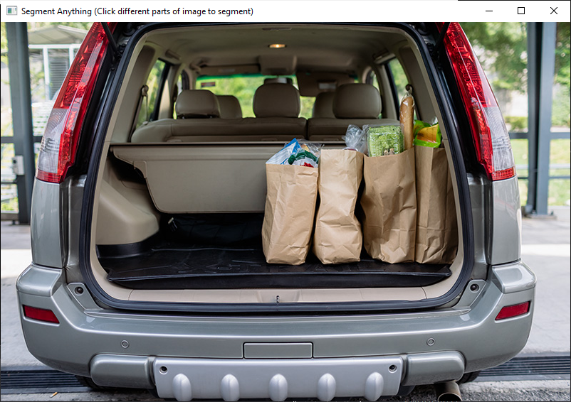
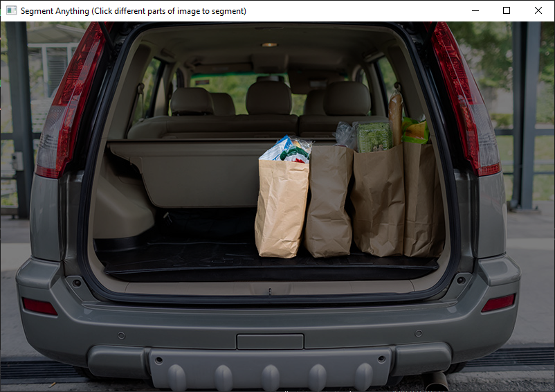

# SamSharp
---
A C# interface for Meta's Segment Anything Model (SAM). This repo contains a small interface project to interact with SAM and get a simple point mask from an image, as well as a small demo project to test mask generation from an image file in an interactive window.

The ImageUtility class uses System.Drawing for image processing; therefore this class is currently only compatable with Windows. Eventually I will migrate this to a cross-platform library if this project gets a full nuget release.

### Generating the Models ###

There are two models needed for this to run

1. <b>Encoder:</b> The encoder needs to be exported from the <i>export_encoder.py</i> script. The PyTorch model will need to be downloaded from either the [Segment Anything repo's](https://github.com/facebookresearch/segment-anything) checkpoints or from [MobileSAM's](https://github.com/ChaoningZhang/MobileSAM/blob/master/weights/mobile_sam.pt) repo for a faster and much lighter model (recommended if your hardware isn't as beefy)
2. <b>Decoder:</b> The decoder model can be generated from the Segment Anything's [Onnx Model Example's](https://github.com/facebookresearch/segment-anything/blob/main/notebooks/onnx_model_example.ipynb) notebook

Once these are generated, select the preprocessor and decoder onnx files when prompted with the file dialog. Then select an image.

Click anywhere to start segmenting

### Unity Compatibility ###

The SamInferenceSession class will work in Unity with all the required DLLs for the [OnnxRuntime](https://www.nuget.org/packages/Microsoft.ML.OnnxRuntime#readme-body-tab) in the project's plugins folder. The ImageUtility class should work as well with required System.Drawing DLLs, but it would be better to have a custom written class that uses Unity's Texture2D at that point.

It also should work with the [Sentis](https://unity.com/products/sentis) package with rewritten classes

